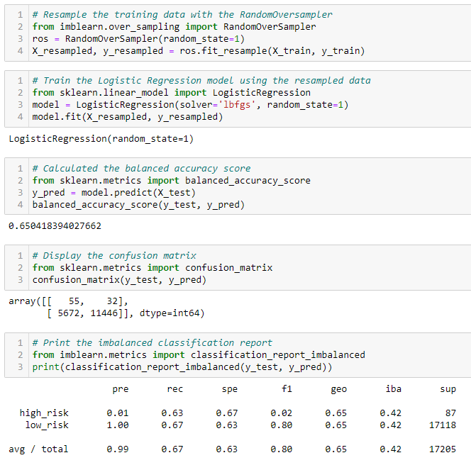
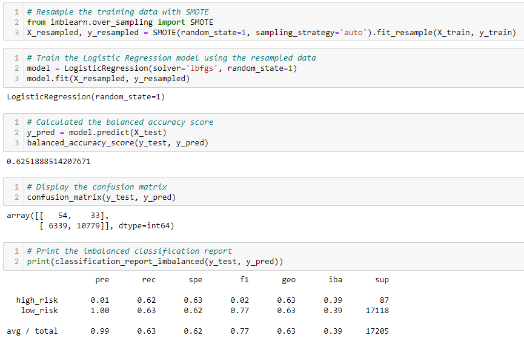
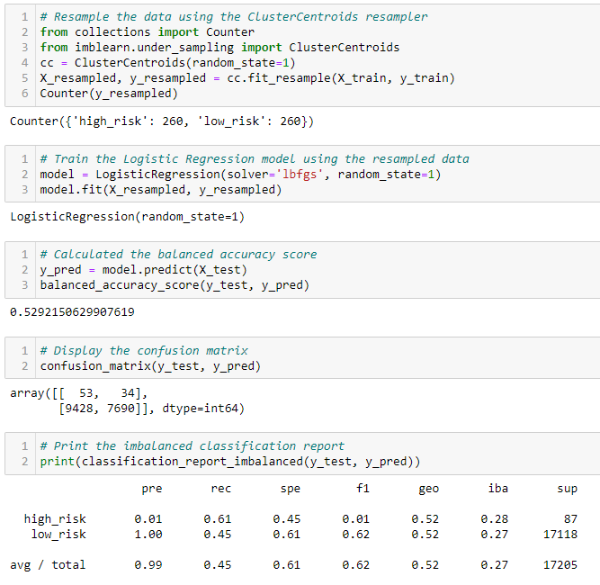
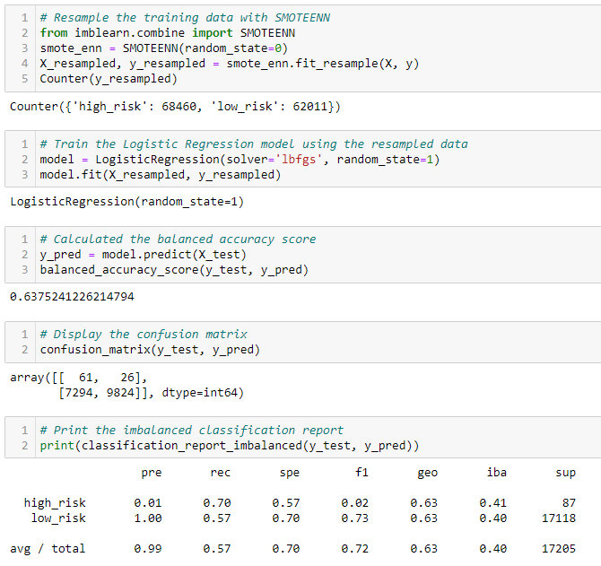
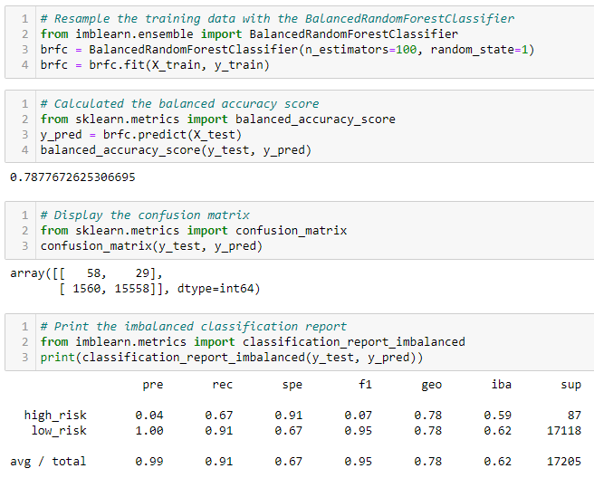
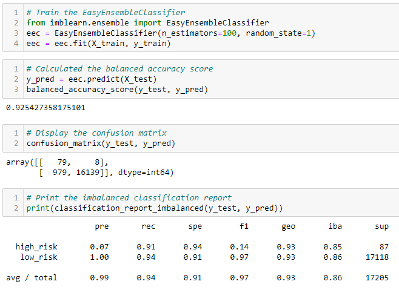

# Credit Risk Analysis Using Supervised Machine Learning

## Overview

### Purpose
The purpose of this analysis was to evaluate the performance of machine learning models using a credit card dataset to make a recommendation on whether they should be used to predict credit risk.

## Results

### Resampling Models to Predict Credit Risk
I first oversampled the data using naive random oversampling, SMOTE oversampling, and undersampling algorithms to predict credit risk.

#### Naive Random Oversampling Using RandomOversampler

- The balanced accuracy score is 65%.
- The precision score for high_risk is 1% with a sensitivity score of 63%.
- The precision score for low_risk is 100% with a sensitivity score of 67%.
- Overall, the precision score is 99% with a sensitivity score of 67%.

#### SMOTE Oversampling

- The balanced accuracy score is 63%.
- The precision score for high_risk is 1% with a sensitivity score of 62%.
- The precision score for low_risk is 100% with a sensitivity score of 63%.
- Overall, the precision score is 99% with a sensitivity score of 63%.

#### Undersampling Using ClusterCentroids

- The balanced accuracy score is 53%.
- The precision score for high_risk is 1% with a sensitivity score of 61%.
- The precision score for low_risk is 100% with a sensitivity score of 45%.
- Overall, the precision score is 99% with a sensitivity score of 45%.

### SMOTEENN Algorithm to Predict Credit Risk
I then used a combinatorial approach of over and undersampling with the SMOTEENN algorithm to determine if the results were better at predicting credit risk than the earlier resampling models.

#### Combination (Over and Under) Sampling Using SMOTEENN

- The balanced accuracy score is 64%.
- The precision score for high_risk is 1% with a sensitivity score of 70%.
- The precision score for low_risk is 100% with a sensitivity score of 57%.
- Overall, the precision score is 99% with a sensitivity score of 57%.

### Ensemble Classifiers to Predict Credit Risk
Finally, I trained and compared two different ensemble classifiers, BalancedRandomForestClassifier and EasyEnsembleClassifier, to predict credit risk.

#### Balanced Random Forest Classifier

- The balanced accuracy score is 79%.
- The precision score for high_risk is 4% with a sensitivity score of 67%.
- The precision score for low_risk is 100% with a sensitivity score of 91%.
- Overall, the precision score is 99% with a sensitivity score of 91%.

#### Easy Ensemble AdaBoost Classifier

- The balanced accuracy score is 93%.
- The precision score for high_risk is 7% with a sensitivity score of 91%.
- The precision score for low_risk is 100% with a sensitivity score of 94%.
- Overall, the precision score is 99% with a sensitivity score of 94%.

## Summary
The first three resampling models and the combination sampling model had similar balanced accuracy scores between 63-65%, with the only exception being the undersampling model with a balanced accuracy score of 53%. This is significantly lower than the ensemble classifiers where the BalancedRandomForestClassifier had a balanced accuracy score of 79% and the EasyEnsembleClassifier had a balanced accuracy score of 93%. Since we are looking for models to assess credit risk, it is important to look specifically at the high_risk variable. We want high precision scores because precision is a measure of how reliable a positive classification is, and we want high sensitivity scores because sensitivity looks at how many loans that actually are high risk were correctly labeled as such. Looking at the precision scores, we can see that the three resampling models and the combination sampling model had a precision score of 1% for high_risk. Their sensitivity scores ranged between 61-63%, with the only exception beling the SMOTEENN model with a sensitivity score of 70%. The ensemble classifiers, however, had higher precision scores and higher sensitivity scores, most notably the EasyEnsembleClassifier with a precision score of 7% and a sensitivity score of 91%. EasyEnsembleClassifier also had the highest precision score and sensitivity score for low_risk with 100% and 94% respectively. Therefore, I would recommend the use of the EasyEnsembleClassifier as it had the highest balanced accuracy score, the highest precision scores, and the highest sensitivity scores amongst all the models.
